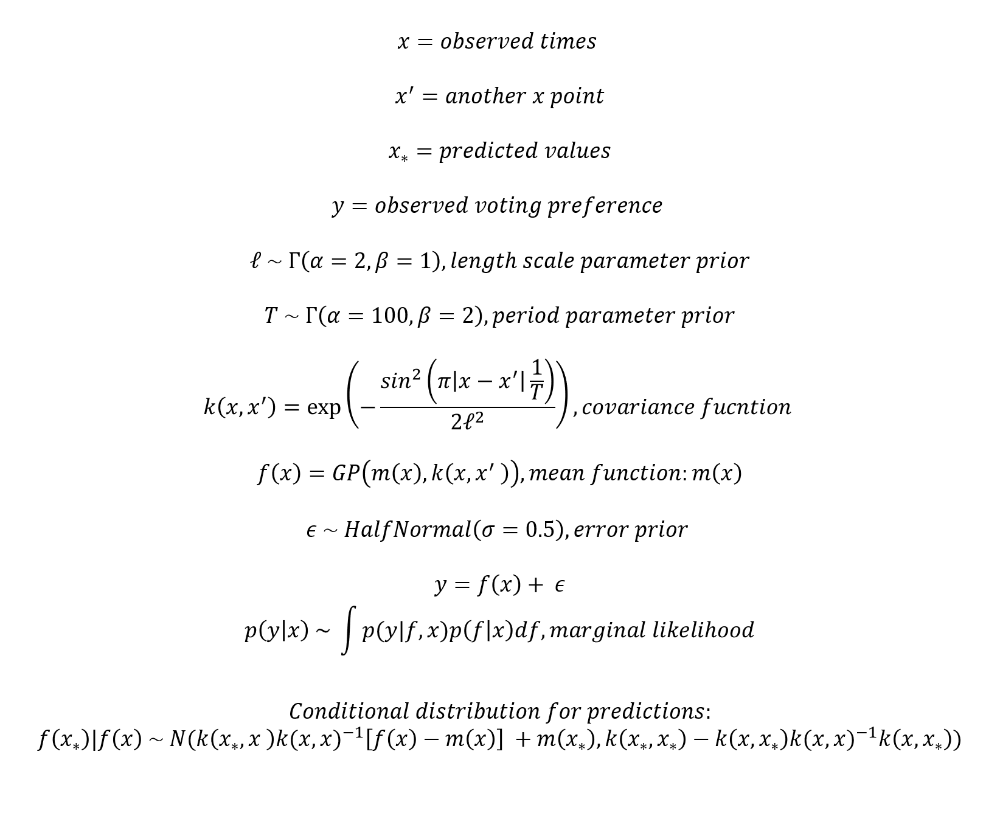
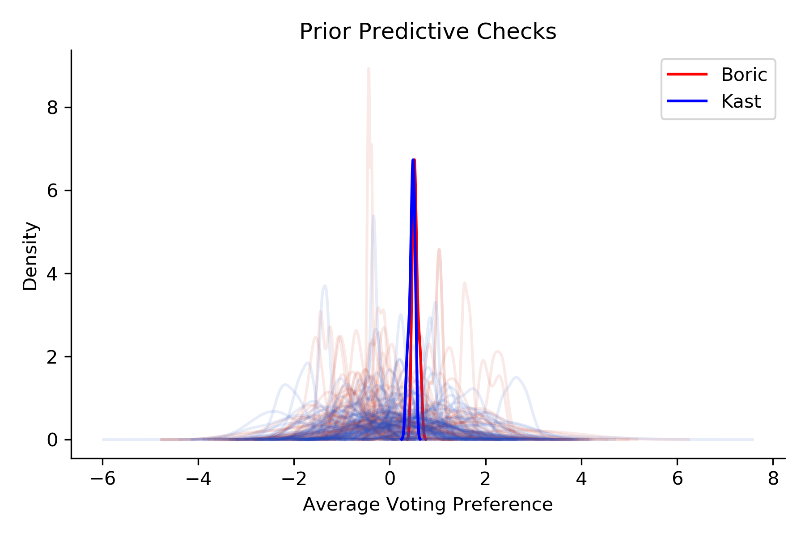
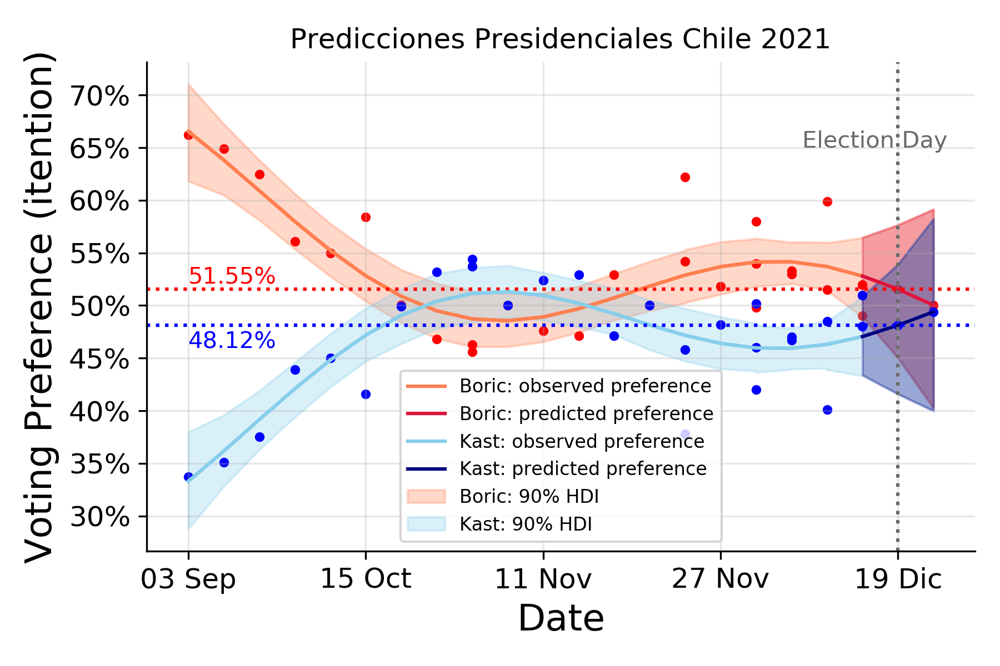

<h1> Electoral Forecasting with a Gaussian Process </h1>

The present analysis implements a Gaussian process for forecasting presidential elections. As opinion (voting intention) polls are taken with certain regularity, voting preference could be represented as a periodic function, where each poll provides a value of voting preference (a percentage) for a given candidate. This can be modelled via a Gaussian process using a periodic covariance function. This may be quite a simplistic approach, especially considering the more sophisticated (and successful) approaches for predicting electoral results, check this episode: https://www.youtube.com/watch?v=DollGZcRR9M&ab_channel=AlexandreANDORRA of the great Learning Bayesian Statistic podcast. Such approaches use richer datasets, and can implement models based on Gaussian random walk and autoregression (https://github.com/INWTlab/lsTerm-election-forecast) or on post stratification (https://austinrochford.com/posts/2017-07-09-mrpymc3.html). Even so, let's give a try this simple Gaussian process using a very small dataset.    

<h1> Model </h1>

 The image below shows the model specifications, where <i style="font-family:'Serif'">x</i> are the times (dates) when polls were taken, and <i style="font-family:'Serif'">y</i> is the voting preference (in percentages). The rest are common specifications of priors and conditional distribution for a Gaussian process with a periodic covariance function. For more details you can see Bayesian Analysis with Python (Martin, 2018; Gaussian Process chapter), or here: https://docs.pymc.io/en/v3/Gaussian_Processes.html, and here: https://docs.pymc.io/en/v3/pymc-examples/examples/gaussian_processes/GP-Marginal.html 

 Before running the model, I run some prior predictive checks. As the gaussian process allows for negative values, these do not look so good (see image below). Even so, their values should end up adapting reasonably well to the observed data, given data constraints. 

<h1> Results </h1>

 I sampled the model using Markov chain Monte Carlo (MCMC) No U-turn sampling (NUTS) with 1000 tuning steps, 1000 samples, and 4 chains. The model sampled well, with <i>R&#x5e;</i> <i>&#8771;</i> 1,  BFMIs > 0.9, and bulk ESS > 2000 for all parameters. Results below show that priors indeed adapted well. Model shows good highest density intervals (HDIs) for the observed period (until 10 Dic, latest poll), indicating a very reasonable certainty for a model with very few datapoints. Predictions for election day favour candidate 1 (Boric) who gets ~3.4% more votes (intended) over the other candidate. However, predictions (after 10 Dic, i.e. 19 Dic and beyond) show higher uncertainty respect to the observed period, with wide HDI overlap. 

<h1> Conclusion </h1>

 Although uncertain, present predictions generally coincide with raw estimates circulating in Chile and with some 'hunch estimates' from analysts. I run models with additive Gaussian processes, which showed opposite results (but by a closer 1% margin). However, I decided against model comparison or averaging, because there's no reason to assume that an election period, or even an election year, can be divided in subperiods or modelled as additive periods. Rather, it seems like a constant oscillation of poll results, where candidates go up and down according to the surrounding context. This is a weak 'theoretical' reason for model selection, mainly based on listening to political analysis podcasts (yes, I'm a bit of a political junkie), but makes a bit of sense for present purposes. Given that, present model, though simple, seems more accurate to me (that's, certainly, open to criticism). Anything could happen that drastically alters this prediction, but hopefully it will be more-or-less accurate. Note that if we extend one more period beyond election day (i.e. an hypothetical, non-existent, third round), both candidates get quite close to each other, but with increased uncertainty.  Even so, predictions are as good as the data they come from. Polls in Chile are infamously biased, and present data is just from those polls reported in Wikipedia. Therefore, present forecast must be taken with a tablespoon of salt, especially because present approach is only a toy example or proof of concept. With some luck, this prediction may be accurate. 

